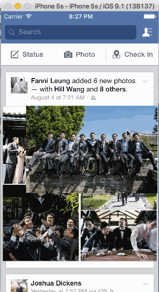

# Week 5 Project: Facebook

The purpose of this homework is to leverage animations and gestures to transition between screens. We're going to use the techniques from this week to implement some interactions in Facebook.

Time spent: 20 hours spent in total

Completed user stories:

* Tapping on a photo in the news feed should expand the photo full screen.
* Tapping the Done button should animate the photo back into its position in the news feed.
* On scroll of the full screen photo, the background should start to become transparent, revealing the feed.
* If the user scrolls a large amount and releases, the full screen photo should dismiss.
* Optional: The full screen photo should be zoomable.

Note:

I didn't understand the directions for the optionals, so I looked at the Facebook app and recreated the post screen with all photos. 

Walkthrough of Facebook app:

GIF created with [LiceCap](http://www.cockos.com/licecap/).

# Facebook-week5
